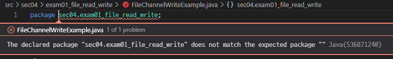
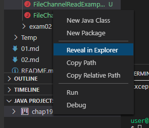
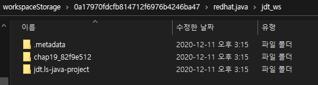
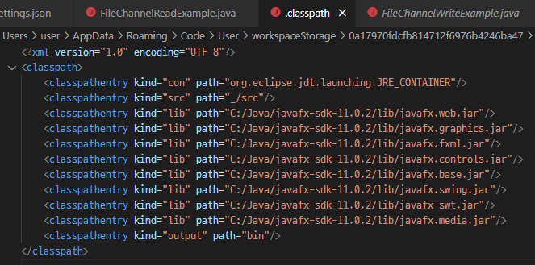

# Java(538671240)

> ##### The declared package does not match the expected package...

## 현상

> ###### [참고 1](https://github.com/redhat-developer/vscode-java/issues/1406), [참고 2](https://stackoverflow.com/questions/48260426/vs-code-expected-java-package-name-error), [참고 3](https://stackoverflow.com/questions/40900003/the-declared-package-does-not-match-the-expected-package-for-apache-commons)

vscode로 Java 프로젝트 관리시 갑자기 package 경로를 제대로 인식하지 못하는 경우가 있다. 이 때 vscode는 `package <name>`을 지우라거나, 경로를 더 추가하라는 제안을 보여준다. 하지만 알다시피 그것은 우리가 원하는 해결법이 아닐 것이다.

## 해결

지금 필자는 빌드도구를 사용하지 않고 학습용으로 `.java` 파일만 사용하는데, 어차피 vscode의 입장에서는 Java를 실행하기 위해서 Java Project를 생성할 것이다. 즉, 어딘가에 `.class` 파일 등이 생성되어 있다는 소리다.

따라서 아래와 같이 Java Project 탭에서 `Reveal in Explorer`를 눌러준다. 파일 탐색기에서 Java Project를 연다.

기다리면 우리가 생성한 프로젝트가 아닌 AppData와 같은 디렉토리에 꽁꽁 숨겨져 있다.

그럼 진짜 vscode가 관리하는 Java Project를 발견할 수 있다.

가운데 `<프로젝트명>_<캐시?>` 폴더에 들어가면 `.classpath`이 있을 것이다. vscode로 열어서 확인하면 src 경로에 이상한 값이 채워져 있을 것이다.

`<classpathentry kind="src" path="_/src"/>`으로 깔끔하게 변경해주면, 이전과 같이 package에서 문제가 생기지 않을 것으로 예상된다.

vscode로 프로젝트를 관리하는 것은 초보 개발자의 입장에서 결코 쉽지 않다. 워낙 확장성이 뛰어나고 가볍다보니 개발자가 일일이 신경쓸 부분이 많다. 아마 eclipse나 visual studio에서는 이런 현상이 잘 일어나지는 않을 것이다. 아직까지도 개발자를 위한 개발은 많이 부족한 것 같다.